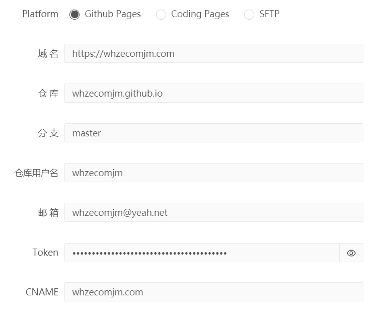
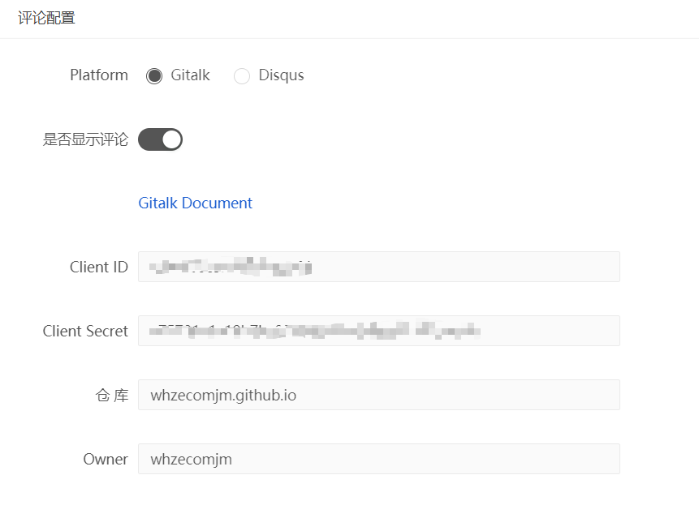

#  Gridea 

✍️ **Gridea** 一个静态博客写作客户端。你可以用它来记录你的生活、心情、知识、笔记、创意......

## 特性👇

📝 你可以使用最酷的 **Markdown** 语法，进行快速创作

🌉 你可以给文章配上精美的封面图和在文章任意位置插入图片

🏷️ 你可以对文章进行标签分组

📋 你可以自定义菜单，甚至可以创建外部链接菜单

💻 你可以在 **Windows**，**MacOS** 或 **Linux** 设备上使用此客户端

🌎 你可以使用 **𝖦𝗂𝗍𝗁𝗎𝖻 𝖯𝖺𝗀𝖾𝗌** 或 **Coding Pages** 向世界展示，未来将支持更多平台

💬 你可以进行简单的配置，接入 [Gitalk](https://github.com/gitalk/gitalk) 或 [DisqusJS](https://github.com/SukkaW/DisqusJS) 评论系统

🇬🇧 你可以使用**中文简体**或**英语**

🌁 你可以任意使用应用内默认主题或任意第三方主题，强大的主题自定义能力

🖥 你可以自定义源文件夹，利用 OneDrive、百度网盘、iCloud、Dropbox 等进行多设备同步


## Gridea 的安装配置

1. 我们首先需要**创建一个仓库 [Token](https://github.com/settings/tokens)，勾选上 repo 的相关权限即可**。生成之后记得把 Token 复制到你的本地，因为一旦关闭网页将不能再看到它。
2. **创建仓库，存放构建后的网站文件**。创建一个公开仓库，名为 `username.github.io`。（将username替换为本人的 Github 用户名）
3. **进入 Gridea 进行远程设置**。安装完毕Gridea以后，按照下图的示例进行设置，然后点击「检测远程链接」，进行配置检查。这一步 CNAME 可以设置自定义域名。我的设置如下(域名第一次没有打开 SSL 时不要加s，之后修改即可，参见第5步)：
   
4. **同步**。点击 Gridea 中的 同步按钮即可。初次部署等待几分钟之后就可以去浏览器访问了，默认地址为你在第 3 步所填写的域名。
5. **打开SSL**。第一次新建仓库cname之后的网站没有打开ssl，需要等待一段时间以后在仓库设置里的Github Pages > Enforce HTTPS  中打开。打开之后记得更新 Gridea 设置的域名。
6. **添加评论功能**。可以使用gitalk。首先申请一个 [OAuth Apps](https://github.com/settings/developers)，填写的Application Name为之前的仓库名（也可以先新建一个仓库用于评论，为了简便直接用博客仓库评论也是可以的）。Homepage URL 和 Authorization callback URL 填入完整的博客首页。之后将得到的 Client ID 与 Client Secret 填入到 Gridea 的评论配置中即可。
   

以上，就完成一个静态博客的搭建了~

参考文献: [Gridea 小白上手教程](https://fehey.com/post/hve-notes-start/).


## 相关主题的一些微小自定义

### Simple

1. 归档自定义**实心方块列表** (main.less)

   ```less
       // 在第312行 .archives-container .post 内的padding bottom下添加如下样式:
       display: list-item;
       list-style-type: square;
       margin-left: 1em;
   ```

2. 由于使用了 fontawesome.js，所以直接更改或者添加相应id即可，比如

   1. 在 sidebar.ejs 第28行中的 'facebook' 改为 'linkedin' ；
   2. 在 config.json 第74-75行相应更改即可。
   
3. **添加 RSS 图标和链接**，类似于2的方法，在sidebar.ejs 修改 <div class="site-footer"> 为

   ```html
   <%- themeConfig.footerInfo %> | <a class="rss" href="<%= themeConfig.domain %>/atom.xml" target="_blank"><i class="fas fa-rss"></i></a>
   ```

4. sidebar 右侧的 scroll 删除。位于 `main.less` 第26行，注释掉即可。

5. 更新**KaTeX**以消除不等号的 bug。 把head.ejs里的KaTeX的版本调整为 0.11.1 即可。

6. achieves 里的年份 fade-in 效果不好改为 fade-up. (第18行)

   ``` html
   <h2 class="year" data-aos="fade-up"><%- year %></h2>
   ```

7. 将主题内的 unpkg 的 js/css 替换为 cndjs 的 CDN 使其加载更快。

    

   


whzecomjm
2019-12-29 12:23