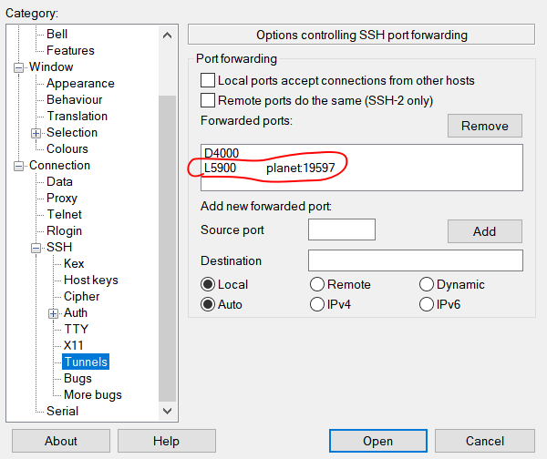
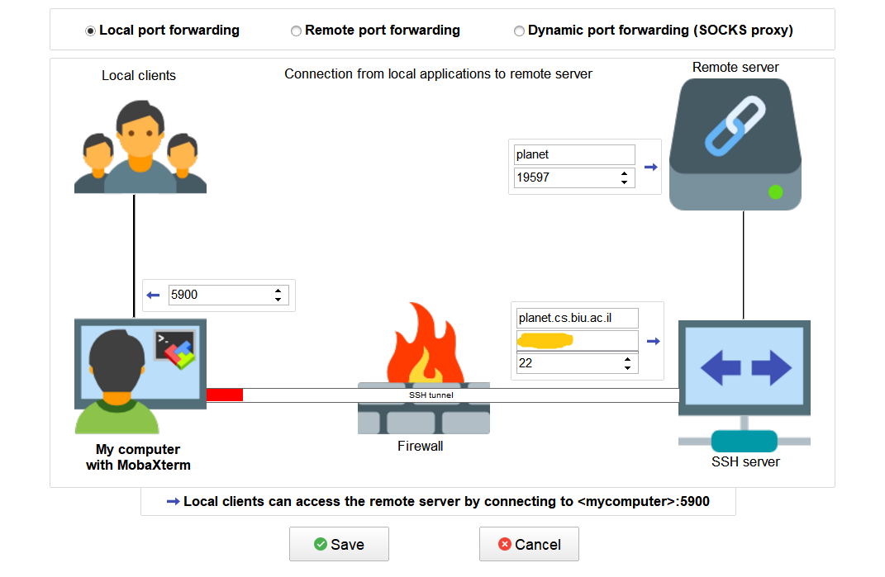
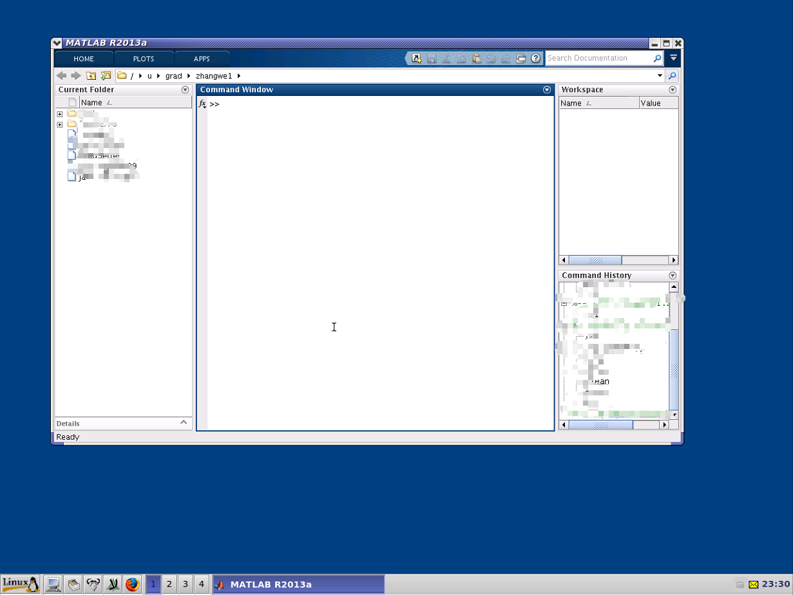

# 使用 MobaXTerm 打开图像化的远程服务器

[toc]

刚来到 BIU 的时候，系里的计算机工程师就跟我讲我有了系里电脑的账号和对应的系里服务器账号。然而我一直只是使用 SSH 或者 SFTP 将自己电脑的文件和学校电脑同步。偶尔的一次机会看到了系里账号的配置网页 [BIU-Remote Graphical Applications](http://ezra.cs.biu.ac.il/?p=241&page=2) 中有关于远程图形化应用程序的骚操作。

经过一番研究发现学校远程服务器的Linux系统中装了 VNC server，可以远程调用这台服务器。于是我兴冲冲地按照上述网页的指示进行操作。

## 安装和初步使用 X Windows

1. 首先下载安装 MobaXterm（[此处有便携版](https://www.nocmd.com/5704.html)）， 创建 一个新的 ssh 连接 BIU-math，相应服务器地址和端口如下（这个地址在上述网页中没有明确，系里的管理员也没有给过我，是有一次我查看系里电脑的账户是怎么与服务器同步发现的）：

   ```
   planet.cs.biu.ac.il:22
   ```

2. 填入用户名和私钥位置（在Advanced SSH setting中使用private key）。

3. 由于远程服务器支持X Windows。在登录之后的命令行中输入程序命令，可以直接调用远程服务器中的应用。已检测到的 BIU-math 拥有的程序如下表。比如我们输入 matlab 就能弹出一个 matlab 的虚拟窗口。

   | 程序代码 | 程序介绍                 |
   | -------- | ------------------------ |
   | acroread | Adobe Acrobat            |
   | display  | X display 主程序，图形化显示打开远程文件   |
   | emacs    | Emacs                    |
   | firefox  | Firefox                  |
   | gap      | GAP (命令行界面)         |
   | magma    | magma (命令行界面)       |
   | matlab   | Matlab 2012b             |
   | sage     | sage (命令行界面)        |
   | soffice  | Open Office              |
   | smath    | Open Office Math Formula |
   | xmaple   | Maple 14                 |


## 进阶使用 VNC 远程可视化

上述方法只能通过 X windows 调用特定的程序，而且延迟比较严重，实际效果较差。于是我继续查看网页介绍的方法。说是要安装一个 VNC Viewer 比如 RealVNC。不过在我下载 RealVNC 的同时，我发现 MobaXTerm 也是支持 VNC Viewer 的，于是用它尝试了一下。


1. **连接SSH，打开vncserver**。首先使用 putty 或者 MobaXTerm 的 SSH 功能连接登录 BIU-Math。连接完成后在命令行中输入 `vncserver`。

2. **初始化vncserver**。第一次使用会需要初始化密码，输入一个密码重复两次（为了方便记忆我直接使用连接密码）。之后弹出如下内容：

   ```shell
   New VNC server is "planet:13697"
   
   To tunnel VNC "planet:13697" through SSH:
   Click on the upper left corner of PuTTY
   Select "Change Settings..."
   Under "Category" select:
   "Connection"->"SSH"->"Tunnels"
   Under "Add new forwarded port"
   Source port: 5900
   Destination: planet:19597
   Click "Add"
   Click "Apply"
   (Leave PuTTY running)
   
   To run a VNC Viewer:
   Server: localhost
   
   To stop VNC "planet:13697":
   vncserver -kill :13697
   ```

3. **添加本地转发端口。** 我们需要在 putty 或者 MobaXTerm (位于 Tools >Network > SSHTunnel ) 添加一个本地转发端口 5900，目标为 `planet:19597`。两种方法如下图所示。（Moba还支持自动启动和自动重连）
   

   

4. **浏览VNC。** 保持端口打开，在 MobaXTerm 中新建一个 VNC 进程, 只要填写 localhost 即可 (端口默认是5900与我们vncserver的设置一致)。
5. **大功告成。** 连接以后就大功告成！
   


## 题外话：SSH 转发端口科学上网

其实上次回国的时候我就发现，我可以在putty中新建一个转发动态端口 `D4000` 来做 socks 代理，让我在家能用上学校的校园网下载论文（当然也顺便能科学上网）。这一次安装了 MobaXTerm，我发现同样也是能这样设置的。

具体讲讲：在putty或者MobaXTerm中设置并开启转发端口以后，在 Chrome 中安装扩展 Proxy SwitchyOmega。在其选项设置中添加一个代理服务器，代理协议 socks5，服务器是localhost:4000。然后就可以愉快地上网了。

whzecomjm
2019-12-28 23:06


