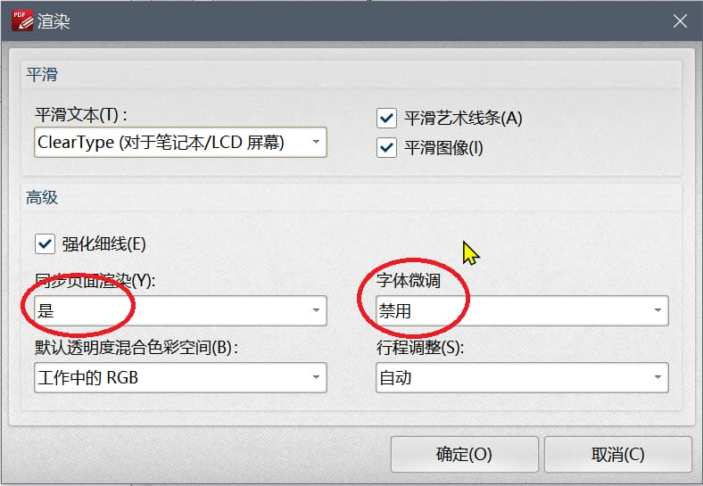

# PDF-XChange Editor

> PDF-XChange Editor – 最小，最快，功能最丰富的免费PDF编辑器/PDF阅读器！专注于PDF电子文档的编辑功能，体积小巧，速度飞快，界面友好，打开PDF文件速度快，具备丰富的配置和功能选项，可以帮助您快速的制作和编写PDF电子文档！支持创建，查看，编辑，注释，OCR识别和数字签名PDF文件等等功能。

个人觉得官方上述说法不算夸大，PDF-XChange Editor 的确好用！特别是编辑 PDF 十分方便！另外，它还支持 PDF 压缩 （Optimization）。

## 字体随时间变化的乱码 Bug

1. 从PDF-XChange Viewer到PDF-XChange Editor都有这个问题，当前正在看的页面内容慢慢变成空白，但PDF上面的标注能显示，只有重新打开才能解决。
2. 注释过后的有时会出现乱码，这时候可以通过将书签导出之后，重新打开pdf文件，再导入书签。

上述两个问题，应该都是渲染的问题。我做了如下的设置，似乎解决了问题（👌）。

> 打开首选项>页面显示>渲染；将**同步页面渲染打开**和**字体微调禁用**。

> 进一步可以把笔画(行程)调整关闭.

2019年12月看到官方论坛有一个人提出[同样问题](https://forum.tracker-software.com/viewtopic.php?f=62&t=30723)，官方解释是可能是硬盘关闭了，则可以通过调整控制面板的电源设置改变。【试试看看是否有改善】

## 一些使用技巧

1. 【增量保存】使用pdf的增量保存, 之后在保存优化版本的pdf可以加快保存。
2. 【注释】可以使用我的 Slate 书写板注释，再作为背景添加到 pdf 文件中。
3. 【打字机注释】打字机使用 ink free 字体很有手写的感觉。
4. 【全局快捷键】PDF-XChange 禁用了不少全局快捷键，如果需要用天若OCR等，需要在Windows任务栏中激活。

whzecomjm 

2019-07-12 14:40:54

