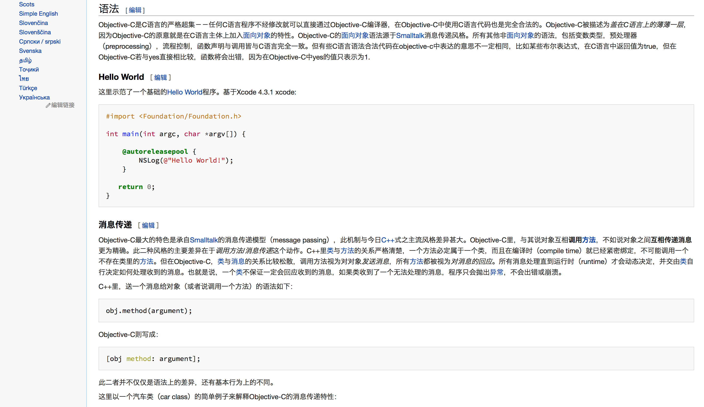
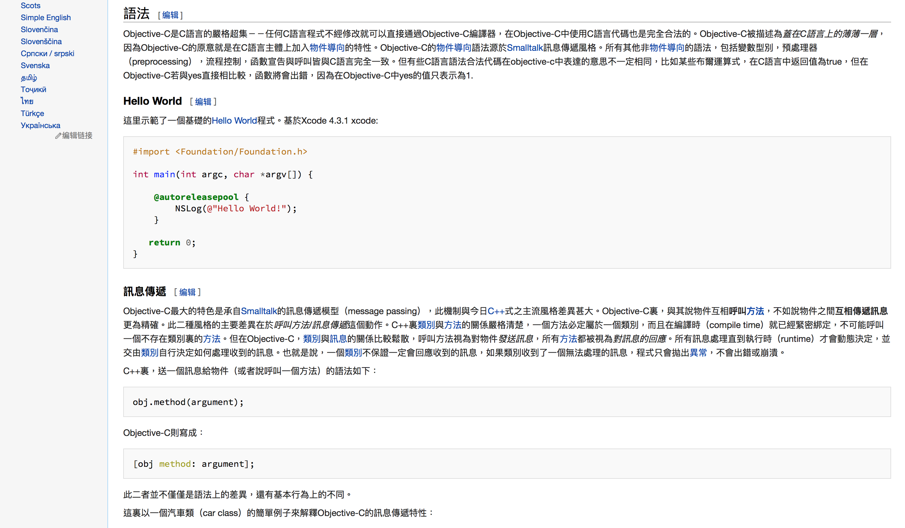
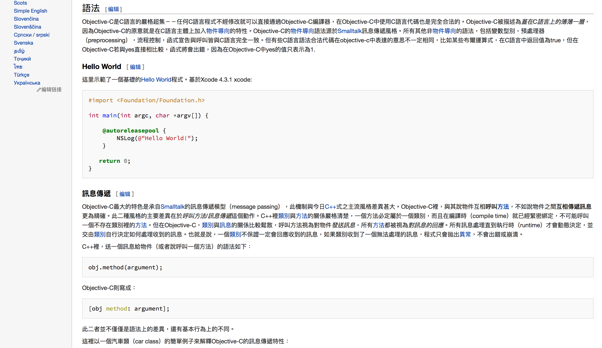

# Neo-Grotesque
Neo-Grotesque is a term of typeface, which described a modern design consists of a direct evolution of grotesque types. One of the most famous typeface is Helvetica – The one we could find on the logo of Jeep, 3M, Oral-B, The North Face, American Airlines (old logo), Microsoft (old logo), etc. This CSS style is based on Helvetica (or Helvetica Neue), which means if you have Helvetica or Helvetica Neue installed in your computer (Note that OS X is pre-installed Helvetica and Helvetica Neue), the browser will render the Wikipedia better. Note that I personally suggest you that install Noto Sans CJK to your computer to obtain better user experience.

新歌德体是字体中的一种术语，用来描述现代化的歌德体设计；在新歌德体风格中，最有名的莫过是 Helvetica ——在很多商标中都能找到它的身影：吉普、3M、欧乐-B、The North Face、美国航空（旧商标）以及微软（旧商标）等。本 CSS 样式基于 Helvetica （或 Helvetica Neue）设计，这意味着如果你的电脑中已经安装了 Helvetica 或者 Helvetica Neue（OS X 已经预置），浏览器将会把维基百科渲染地更完美。请注意，我个人建议在你的电脑中安装免费的思源黑体以获得更佳的用户体验。

## Standard of Chinese for Different Regions / 不同地区汉字的标准
This style supports Japanese, Simplified Chinese, Traditional Chinese (Hong Kong), Traditional Chinese (Taiwan).

本样式支持日文、简体中文、繁体中文（香港）、繁体中文（台湾）。

### Simplified Chinese / 简体中文
Hiragino Sans GB is the first priority then followed by Noto Sans CJK SC and PingFang SC which introduced in iOS 9 and OS X El Capitan. Microsoft Yahei, the UI font introduced in Windows Vista for Simplified Chinese following, the last fallback is Heiti SC, the default UI font for Simplified Chinese on iOS 8 and previous versions, and OS X Yosemite and previous versions.

冬青黑体简体中文作为首个设置，紧随其后的是思源黑体；在 iOS 9 以及 OS X El Capitan 中首次出现的苹方作为第三选择（iOS 可渲染），Windows 方面则是微软雅黑——自 Windows Vista 后的简体中文 UI 字体，最后是华文黑体—— iOS 8 以及之前版本、OS X Yosemite 以及之前版本的 UI 字体。

### Traditional Chinese (Hong Kong) / 繁体中文（香港）
In Traditional Chinese styles (Hong Kong and Taiwan), the first priority is Noto Sans TC, since Hiragino Sans GB may not follow the standard of Traditional Chinese. Hong Kong version uses PingFang HK as default UI font since iOS 9 and OS X El Capitan, then is Hiragino Sans GB. On Windows side, Microsoft Jhenghei is the first fallback for Traditional Chinese, which introduced since Windows Vista. The last fallback is Heiti TC, the default UI font for Traditional Chinese on iOS 8 and previous versions, and OS X Yosemite and previous versions.

繁体中文（香港）方面首个设置为思源黑体（繁体）——因为冬青黑体简体中文可能不合繁体中文的相关规范。然后是苹方（香港）——自 iOS 9 以及 OS X El Capitan 后作为 UI 字体，然后才是冬青黑体简体中文。Windows 方面，微软正黑——自 Windows Vista 后作为繁体中文 Windows 的 UI 字体——为首个设置，最后是华文黑体—— iOS 8 以及之前版本、OS X Yosemite 以及之前版本的 UI 字体。

### Traditional Chinese (Taiwan) / 繁体中文（台湾）
The difference between Traditional Chinese (Hong Kong) and Traditional Chinese (Taiwan) is the difference between PingFang HK and PingFang TC, while Taiwan version uses PingFang TC.

繁体中文（香港）与繁体中文（台湾）的区别为苹方（香港）与苹方（繁体中文）。台湾版本使用苹方（繁体中文）。

### Japanese / 日文
The first priorities are Hiragino Sans (Introduced since OS X El Capitan) and Hiragino Kaku Gothic. The Simplified Chinese glyphs will be rendered by the Hiragino Sans GB. Next fallback is Noto Sans CJK JP, a free font family designed by Google Inc. and Adobe Systems Incorporated, and it follows Japanese Standards. Then Meiryo is the default UI font family introduced since Windows Vista, etc. Please note that the Chinese fonts are always follow after Japanese fonts as Chinese fonts contain more glyphs in case Japanese fonts cannot display certain glyphs.

针对日文首个设置为 Hiragino Sans （自 OS X El Capitan 后开始随系统附带） 以及 Hiragino Kaku Gothic. 简体中文字形将会渲染为冬青黑体简体中文。接下来为 Noto Sans CJK JP —— 一个免费的汉字圈字体，由 Google Inc. 以及 Adobe Systems Incorporated 联合设计；并且符合日文标准。然后是 Meiryo 体，自 Windows Vista 后为 Windows 的 UI 字体。请注意中文字体总是会跟随在日文字体后，原因是日文字体通常无法完全覆盖所有汉字，而中文字体在这时作为补充。

## Noto Sans CJK
To get Noto Sans CJK by click <a href="https://www.google.com/get/noto/help/cjk/" target="_blank">__here__</a>. You could download single language package (Simplified Chinese, Traditional Chinese, Japanese, Korean), all-in-one CJK super OTC package, or all-in-one CJK OTC package if your computer supported. Read the instruction by Google carefully.  
__If you are experiencing network control, or you cannot visit the link above, please submit an <a href="https://github.com/starkshaw/wikipedia-stylesheets/issues" target="_blank">issue</a> and I will update the certain package you mentioned to this repository.__

点击<a href="https://www.google.com/get/noto/help/cjk/" target="_blank">__这里__</a>获取思源黑体。你可以根据你的电脑的支持情况，选择下载单一语言包（简体中文、繁体中文、日文、朝鲜文），抑或是四合一 Super OTC 包或者四合一 OTC 包。请谨慎阅读 Google 列出的使用说明。  
__如果你正受到网络管制，或者无法访问上述链接，请提交<a href="https://github.com/starkshaw/wikipedia-stylesheets/issues" target="_blank">事件</a>，我将会向本仓库上传你提到的字体包。__

## Source Code Pro
Source Code Pro is an open source monospaced sans serif font family designed by Adobe Inc. It is ideally used for display formatted code, such as programming code, etc. To get Source Code Pro, please go to their GitHub repository by click <a href="https://github.com/adobe-fonts/source-code-pro" target="_blank">__here__</a>.

Source Code Pro 是一个由 Adobe Inc. 开发的开源的等宽无衬线字体。对于网页中的代码——例如编程代码——具有比较理想的显示效果。点击<a href="https://github.com/adobe-fonts/source-code-pro" target="_blank">__这里__</a>访问他们的 GitHub 软件仓库并获得 Source Code Pro。

## Styles / 样式
- [Neo-Grotesque_zh_CN_Vector.css](Neo-Grotesque_zh_CN_Vector.css)  
  This style is designed for skin “Vector” of Simplified Chinese Wikipedia. Pan-CJK font shown in the figure is Hiragino Sans GB.  
  用于简体中文版本的维基百科皮肤 “Vector”，图中汉字圈字体为冬青黑体简体中文。    
  __Example / 示例__  
  
- [Neo-Grotesque_zh_HK_Vector.css](Neo-Grotesque_zh_HK_Vector.css)  
  This style is designed for skin “Vector” of Traditional Chinese (Hong Kong) Wikipedia. Pan-CJK font shown in the figure is PingFang HK.  
  用于繁体中文（香港）版本的维基百科皮肤 “Vector”，图中汉字圈字体为苹方（香港）。    
  __Example / 示例__  
  
- [Neo-Grotesque_zh_TW_Vector.css](Neo-Grotesque_zh_TW_Vector.css)  
  This style is designed for skin “Vector” of Traditional Chinese (Taiwan) Wikipedia. Pan-CJK font shown in the figure is PingFang TC.  
  用于繁体中文（台湾）版本的维基百科皮肤 “Vector”，图中汉字圈字体为苹方（繁体中文）。    
  __Example / 示例__  
  
- [Neo-Grotesque_JP_Vector.css](Neo-Grotesque_JP_Vector.css)  
  This style is designed for skin “Vector” of Japanese Wikipedia.  
  用于日文版本的维基百科皮肤 “Vector”。  
  __Example / 示例__  
  
  
  __All examples are captured in Safari 9.0 on OS X El Capitan 10.11.__  
  __所有示例都截取自运行在 OS X El Capitan 10.11 的 Safari 9.0。__
